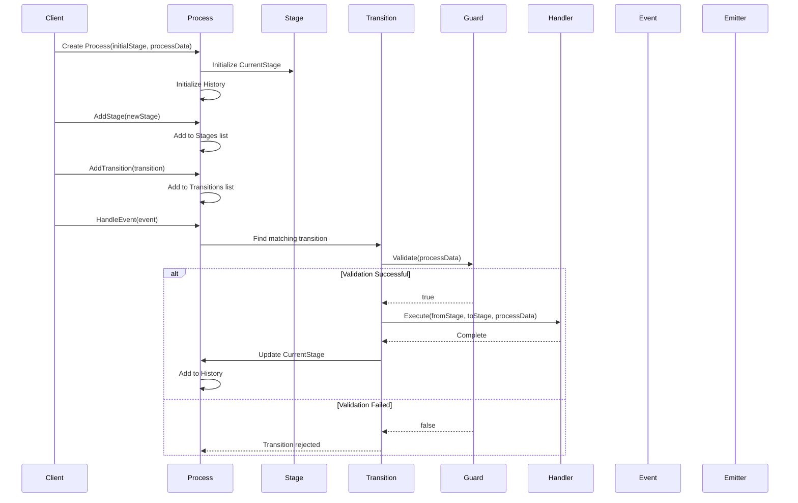

# FlexibleProcess

A flexible process management framework for C# that allows you to model and manage complex business processes with multiple stages, transitions, and event handling.

## Project Structure

```
FlexibleProcess/
├── src/
│   └── FlexibleProcess/
│       ├── Core/                    # Core framework components
│       │   ├── Initiators/         # Event emitter implementations
│       │   │   ├── UserInitiator.cs
│       │   │   ├── SystemInitiator.cs
│       │   │   └── ExternalServiceInitiator.cs
│       │   ├── Process.cs          # Main process container
│       │   ├── Stage.cs            # Process stage representation
│       │   ├── Transition.cs       # Stage transition logic
│       │   ├── Event.cs            # Event representation
│       │   ├── IEmitter.cs         # Event emitter interface
│       │   ├── TransitionHandler.cs # Base transition handler
│       │   └── TransitionGuard.cs   # Base transition guard
│       └── Examples/               # Example implementations
│           └── PackageProcess          # Example process data
│               ├── Package.cs
│               ├── PackageTransitionGuard.cs
│               ├── CustomTransitionHandler1.cs
│               ├── CustomTransitionHandler2.cs
│               └── Program.cs          # Example usage
├── README.md
└── LICENSE
```

## Features

- Generic process management with type-safe data handling
- Multiple stage support with customizable transitions
- Event-driven architecture with different types of event emitters
- Transition guards for conditional state changes
- Customizable transition handlers
- Process history tracking
- Support for different types of initiators (User, System, External Service)

## Core Components

- `Process<T>`: The main process container that manages stages and transitions
- `Stage`: Represents a state in the process
- `Transition<T>`: Defines how to move between stages based on events
- `Event`: Represents an event that triggers transitions
- `IEmitter`: Interface for different types of event initiators
- `TransitionHandler<T>`: Handles transition logic
- `TransitionGuard<T>`: Validates if a transition can occur

## Process Flow

The following sequence diagram illustrates the typical flow of operations in the FlexibleProcess framework:



The diagram shows:
1. Process initialization with an initial stage and process data
2. Adding new stages to the process
3. Adding transitions between stages
4. Event handling flow:
   - Finding matching transition
   - Validating transition with guard
   - Executing transition handler
   - Updating process state and history

## Usage Examples

### Basic Process Creation

```csharp
// Create stages
Stage stage1 = new Stage("Initial Stage");
Stage stage2 = new Stage("Processing Stage");
Stage stage3 = new Stage("Final Stage");

// Create an initiator
IEmitter user = new UserInitiator("user1");

// Create an event
Event startEvent = new Event("StartProcessing", user);

// Create process data
var processData = new CustomData { Id = 1, Status = "New" };

// Create process
Process<CustomData> process = new Process<CustomData>(stage1, processData);

// Add stages
process.AddStage(stage2);
process.AddStage(stage3);

// Create and add transition
var transition = new Transition<CustomData>(stage1, startEvent, stage2);
process.AddTransition(transition);

// Handle event
process.HandleEvent(startEvent);
```

### Nested Process Example (Process<Process<T>>)

```csharp
// Create stages for the main process
Stage mainStage1 = new Stage("Main Stage 1");
Stage mainStage2 = new Stage("Main Stage 2");

// Create stages for the sub-process
Stage subStage1 = new Stage("Sub Stage 1");
Stage subStage2 = new Stage("Sub Stage 2");

// Create initiators
IEmitter system = new SystemInitiator("SYS-001");
IEmitter user = new UserInitiator("user1");

// Create events
Event mainEvent = new Event("MainEvent", system);
Event subEvent = new Event("SubEvent", user);

// Create sub-process data
var subProcessData = new SubProcessData { Id = 1, Status = "Pending" };

// Create sub-process
Process<SubProcessData> subProcess = new Process<SubProcessData>(subStage1, subProcessData);
subProcess.AddStage(subStage2);

// Create main process data containing the sub-process
var mainProcessData = new MainProcessData 
{ 
    Id = 1,
    SubProcess = subProcess
};

// Create main process
Process<MainProcessData> mainProcess = new Process<MainProcessData>(mainStage1, mainProcessData);
mainProcess.AddStage(mainStage2);

// Create transitions
var mainTransition = new Transition<MainProcessData>(mainStage1, mainEvent, mainStage2);
var subTransition = new Transition<SubProcessData>(subStage1, subEvent, subStage2);

// Add transitions
mainProcess.AddTransition(mainTransition);
subProcess.AddTransition(subTransition);

// Handle events
mainProcess.HandleEvent(mainEvent);
subProcess.HandleEvent(subEvent);
```

## Installation

1. Clone the repository
2. Add the project to your solution
3. Reference the FlexibleProcess namespace in your code

## License

This project is licensed under the MIT License - see the LICENSE file for details.